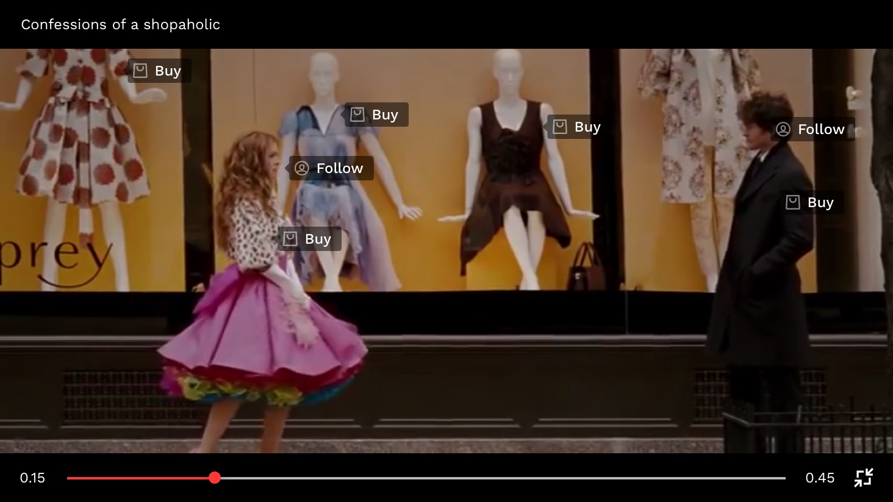

# oediV - Video reimagined
This repository was created as part of a submission for Google's #AndroidDevChallenge.

## The Idea

#### Summary
Oediv displays relevant and contextual information in realtime over videos. By adding an interactive layer over videos, the user can engage with the video in a lot of unique ways including and not limited to - 

* Discovering similar products from the video for sale (fashion, food, electronics, etc).
* Following people on social media platforms.
* offline predictions of products metadata (product price, market availability, etc).

#### On Device Learning

Realtime annotation is achieved by using a custom lightweight deep learning model deployed on the user's device. The model can detect and track objects locally, and relies on the backend to identify the object using data from a feature layer. This approach allows us to create interactions over videos that are - 
* Instant and works in real-time
* Does not require internet; works offline
* Prevents data piracy by not transferring the video to the server for processing.

#### working: 
* The application uses 2 oflline machine learning models to achieve its purpose.
* The first model identifies different products and the persons in the scene on the fly and classifies them according to the product ID and the face ID of the celebrity.
* When the posit layer is enabled, the identified products are run against the second model which then creates a unique 128-bit fingerprint which closely represents the object on the screen and other meta-data of the products. 
* The above scenario happens offline. When the user wishes to buy any product, the generated 128-bit fingerprint is sent to the server which gives the URL of the market place to the buy the closely related product.

#### So far

* Launched a web app to understand user behaviour and get initial feedback. Please see - [Web Demo](http://www.justplay.tv/watch/1). Play the video and pause anywhere to explore the products used. Note that this demo does not use On Device machine learning and was made to collect user feedback.
* Beta version of SDK available on Android. The SDK is currently under test with an Indian video publisher app. The SDK currently does not incorporate On Device Learning. Check out our [SDK Documentation](../master/resources/posit_sdk_doc.pdf).   

## The Plan

* December 7, 2019 - Finalizing the app's use-case to target a specific aspect which will be leveraged using the ML model.
* December 20, 2019 - A working prototype of an android app designed according to the UI design (without ML model).
* January 15, 2020 - Improve the model with an encoding layer to identify the product from a catalogue of items in the backend.
* January 30, 2020 - Convert the existing ML model to use tensor flow lite and complete the offline migration of the current ML model 
* Feb 15, 2020 - Integrating the tensor flow model into the android app.
* March 15, 2020 - Enable the app to listen/observe for any video that is currently playing in the android platform and react by showing the posit layer (product prediction layer).
* March 31, 2020 - Tested working product (standalone app, SDK for distribution)

#### Distribution Plan

* Without Google's support, especially because Android does not have an API for a 3rd party app to listen to video events and share frames, we plan to be available as a plugin for video publishers to integrate into their Android/iOs app. This means only videos streamed via our distribution partners are interactive.

#### Datasource Plan

* By partnering with e-commerce vendors for qualified traffic.
* By on-boarding celebrities and content creators to allow face identification.

#### Google's Support 

* Make our tech a part of Android OS so that we can make all videos interactive instead of just those that are played from our distribution partners. This includes videos that are
  * played locally
  * streamed/played via an app
  
* Expose the Google Shopping Ads data as an API so that we can display products for sale to users. This will help us become globally available instantly by eliminating the need to partner with e-commerce vendors independently.
* Engineering Mentorship to improve detections under occlusions and other complexities 
 
## About Us

#### The Development Team

* Udhaya Kumar - Android Developer 
* Shiddharth Saran - Python Developer  
* Somasundaram M - Machine Learning Engineer
* Jailany M - React Developer
* Manju R - Visual Design
* Karthick L - Product

#### Our Startup

We are a startup working on redefining the way videos are consumed today. For more information please check - www.posit.tech

